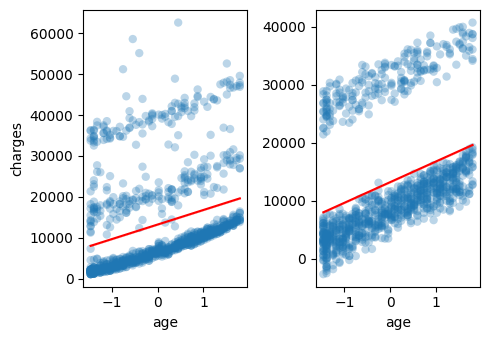
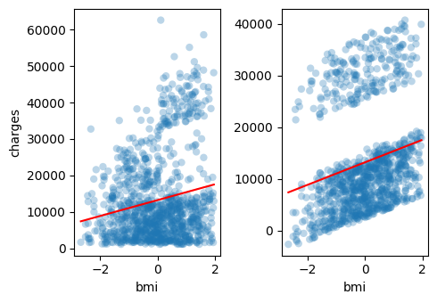

# Linear Regression

## Introduction:

Linear regression is a statistical technique used to model the relationship between a dependent variable and one or more independent variables. In this case, our goal is to predict health insurance charges based on certain factors.
For this example, let's assume we have a dataset that includes information on health insurance charges and associated characteristics of policyholders, such as age, body mass index (BMI), etc.

## Content

- [Usage](#usage)
- [Examples](#examples)
- [Project Structure](#project-structure)
- [Contribution](#contribution)

## Usage

We access to the source folder (src) and inside we have our code in the different notebooks

## Examples

On the left we have the actual values and on the right those predicted by our linear model

## Project Structure

- `models/`: Stores the trained model (if applicable).
- `data/`: Directory to store the training and testing datasets.
- `src/`: Contains the source code for the project.
- `docs/`: Documentation files for the project.
- `README.md`: Project documentation.

## Contribution

Contributions are welcome! If you find any issues or have improvements, please open an issue or submit a pull request.

